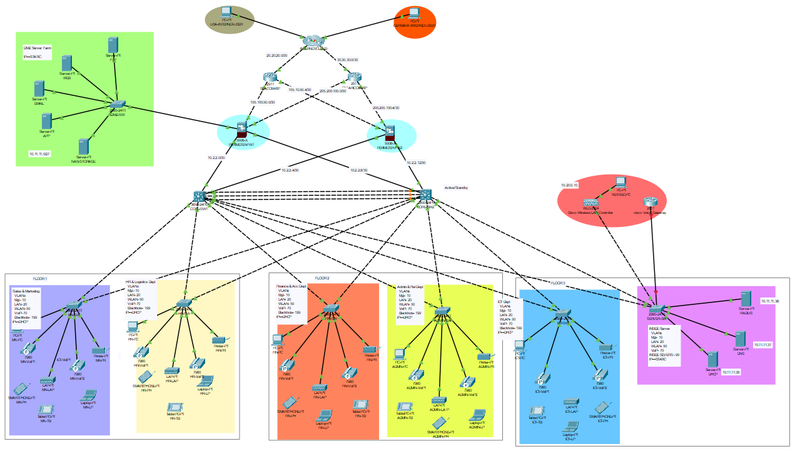

#  Laboratoire Réseau Sécurisé – WAN / LAN / DMZ (pfSense + Cisco)

Ce dépôt regroupe mes deux environnements de laboratoire dédiés à la segmentation réseau et à la sécurité d’infrastructure :

- 🔒 Un lab virtuel **pfSense** (virtualisé avec VirtualBox) simulant un pare-feu en 3 zones.
- 🧬 Un projet **Cisco Packet Tracer** modélisant un réseau d’entreprise complet avec VLANs, DMZ, HSRP, OSPF et redondance via firewalls Cisco ASA.

---

## 📂 Contenu du dépôt

### 1️ pfSense – WAN / LAN / DMZ

**Fichier :** `Rapport_Lab_WAN_LAN_DMZ.pdf`  
📄 Rapport détaillé de configuration avec schémas et captures.

**VM Configurations :**

- Installation et paramétrage de pfSense
- Création des interfaces WAN, LAN, DMZ
- Règles NAT et filtrage interzones
- Server Setup : Installation d’un serveur IIS (Windows Server 2025) dans la DMZ

**Fonctionnalités :**

- Isolation stricte LAN / DMZ
- NAT (port 80 WAN → DMZ)
- Contrôle d’accès explicite
- Test de connectivité LAN ↔ DMZ ↔ Internet

---

### 2️ Cisco Packet Tracer – Réseau d’entreprise sécurisé

**Fichier :** `Advanced_Company_Network.pkt`  
 Simulation complète Packet Tracer d’un réseau d’entreprise segmenté.

**Schémas inclus :**

- VLANs (LAN, WLAN, VOIP, DMZ, Inside Servers)
- Routage inter-VLAN (HSRP + OSPF)
- Pare-feux redondants (FWL1/FWL2)
- Serveurs DHCP, DNS, Web et Mail

**Configurations :**

- VLANs et Trunks (L2/L3 Switches)
- STP PortFast + BPDU Guard
- EtherChannel (Port-channel)
- OSPF multi-zone
- DHCP relay et IP statiques serveur
- NAT et politiques d’inspection sur ASA

**Exemples d’adressage :**

| Zone            | Réseau            | Gateway        | Description         |
|-----------------|-------------------|----------------|---------------------|
| Management      | 192.168.10.0/24   | 192.168.10.1   | Administration      |
| LAN             | 172.16.0.0/16     | 172.16.0.1     | Réseau interne      |
| WLAN            | 10.20.0.0/16      | 10.20.0.1      | Sans fil            |
| VOIP            | 172.30.0.0/16     | 172.30.0.1     | Téléphonie IP       |
| DMZ             | 10.11.11.0/27     | 10.11.11.1     | Serveurs publics    |
| Inside Servers  | 10.11.11.32/27    | 10.11.11.33    | Serveurs internes   |

**Objectifs techniques :**

- Segmentation réseau par VLAN et DMZ
- Redondance (HSRP + OSPF)
- Sécurisation par firewalls (zones + ACL + NAT)
- Simulation de flux LAN ↔ DMZ ↔ Internet

---

## Intégration des deux projets

| Élément           | pfSense Lab         | Cisco Packet Tracer                  |
|-------------------|---------------------|--------------------------------------|
| Pare-feu principal| pfSense             | ASA (FWL1/FWL2)                      |
| Segmentation      | WAN / LAN / DMZ     | VLANs + DMZ + Inside Servers         |
| Routage           | Statique / NAT      | OSPF + HSRP                          |
| Serveurs          | IIS (DMZ)           | DNS, Web, Mail, DHCP                 |

Objectif : Compréhension des architectures réseau sécurisées hybrides (virtuelles et physiques simulées) 

---

## Perspectives d’évolution

- Ajout de VPN site-to-site entre pfSense et le réseau Cisco
- Déploiement d’un IDS/IPS (Snort, Suricata)
- Intégration de la supervision (NetFlow, ELK, Grafana)
- Simulation multisite (entreprise + succursale)

---

##  Auteur

**Angel Velasco** – Étudiant en cybersécurité (ECE Paris)  
**Projets :** Virtualisation (pfSense) + Simulation (Cisco Packet Tracer)  
 **Objectif pédagogique :** Maîtriser la conception d’une architecture réseau d’entreprise sécurisée et segmentée.
